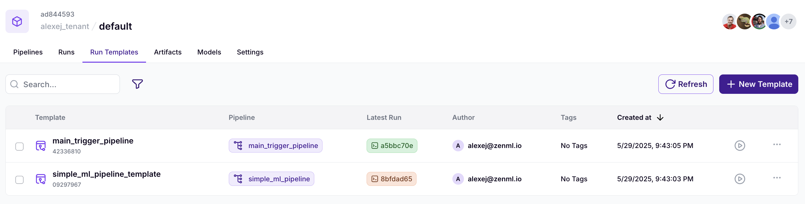
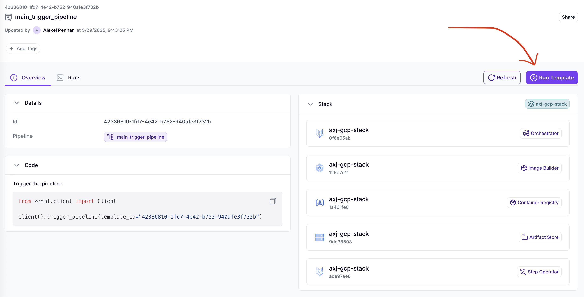
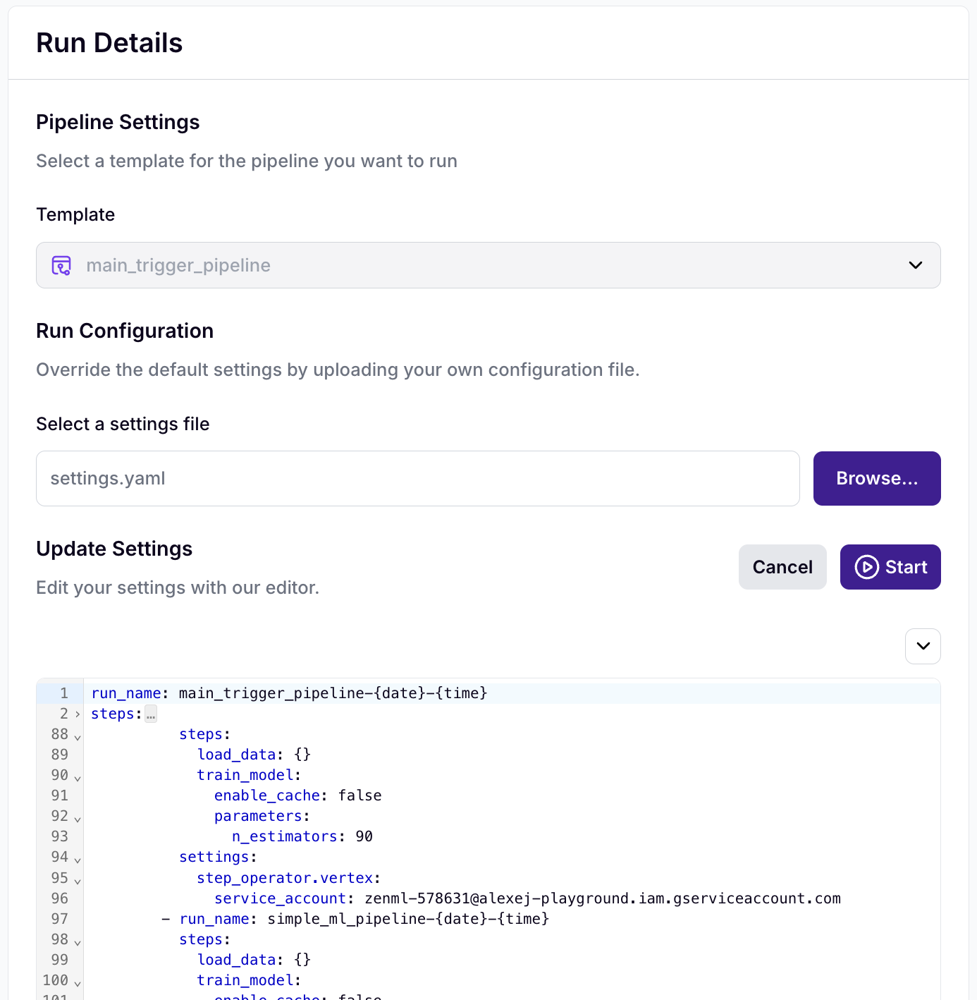
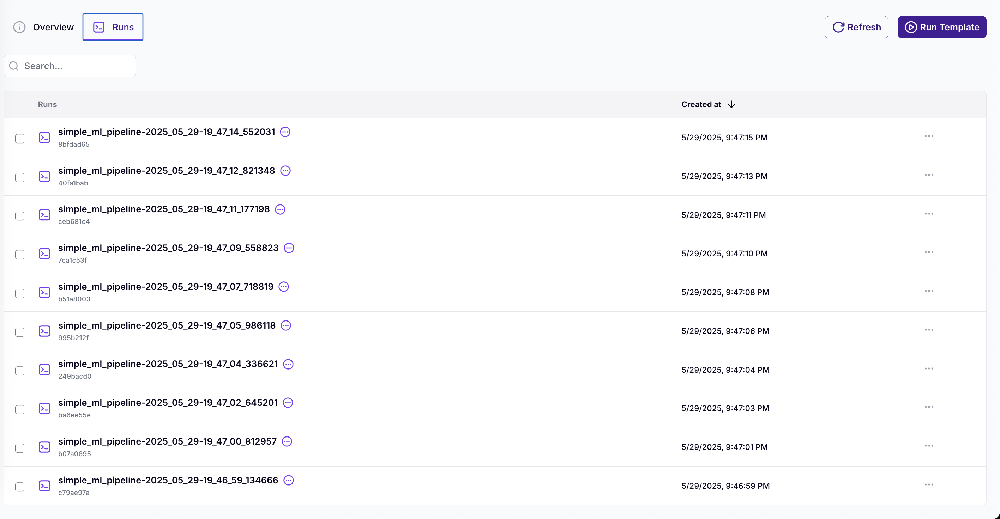

# Trigger Multiple ML Pipelines

This project demonstrates how to use ZenML to create a single run template to use as a singular endpoint to trigger many instances of another run template.
This can be useful when you want to create many slightly different version of a model based on the same code but with different parameters or data. 


## Setup

1. Create and activate a virtual environment:

```bash
# Create a new virtual environment
pyenv virtualenv trigger-multiple-templates

# Activate the virtual environment
pyenv activate trigger-multiple-templates
```

2. Install dependencies using uv:

```bash
# Install requirements
uv pip install -r requirements.txt
```

## Project Structure

- `main.py`: Contains the main trigger pipeline that orchestrates multiple runs
- `pipeline.py`: Defines the base ML pipeline for training models
- `requirements.txt`: Lists the project dependencies
- `.python-version`: Specifies the Python version for pyenv

## How It Works

The project consists of two main components:

1. **Base ML Pipeline** (`pipeline.py`):
   - Loads the Iris dataset
   - Splits the data into training and test sets
   - Trains a Random Forest classifier with configurable number of estimators
   - Uses Docker settings with uv as the package installer

2. **Trigger Pipeline** (`main.py`):
   - Creates a template from the base ML pipeline
   - Generates multiple configurations with different numbers of estimators (0 to 90, in steps of 10)
   - Triggers multiple pipeline runs with these configurations
   - Uses a GCP stack for execution

## Creating the Run Templates

To create the run template:

```bash
python main.py
```

This will:
1. Set up the base ML pipeline template
2. Create multiple configurations with different numbers of estimators to be used as the default config
3. Set up the main_trigger_pipeline which serves as the controller

## Trigger runs when ready

Once the cloud builder has created all the run templates, here is how you can now trigger the runs



*Figure 1: Here is what the ready run templates will look like in your Dashboard*



*Figure 2: Once you clicked into the run template for the main pipeline, you can now decide to run it*



*Figure 3: Heere you now have the option to change the configuration that is passed onto the actual training pipelines*



*Figure 4: Here are 10 instances of the training pipelines running in parallel, triggered by our main pipeline*


## Note

The pipeline is configured to use a GCP stack named "axj-gcp-stack". Make sure you go ahead and change stack, project and other names before you run this. 